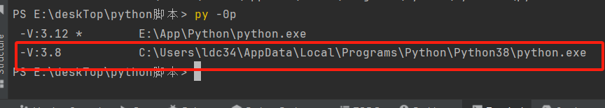
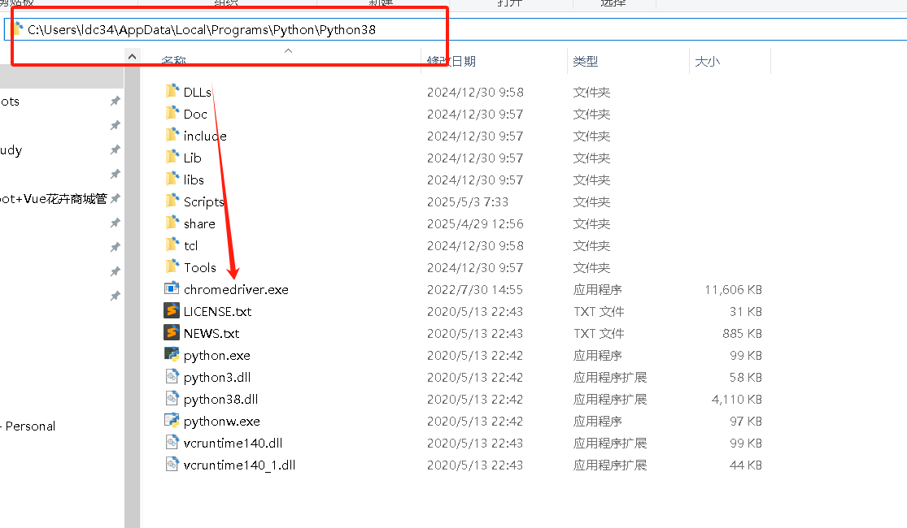
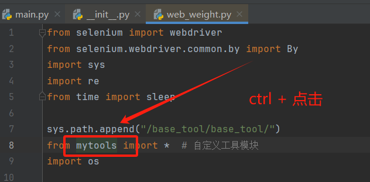
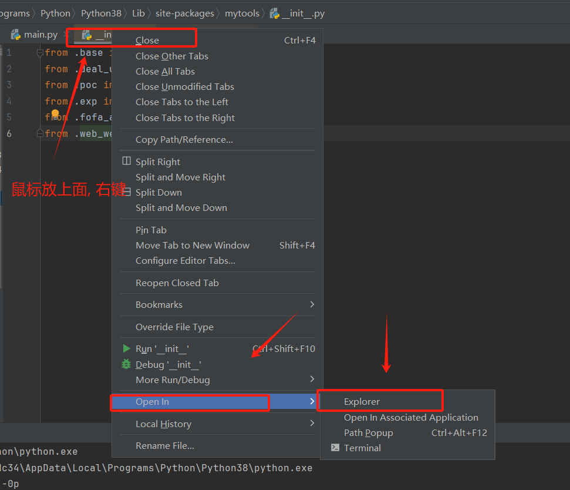
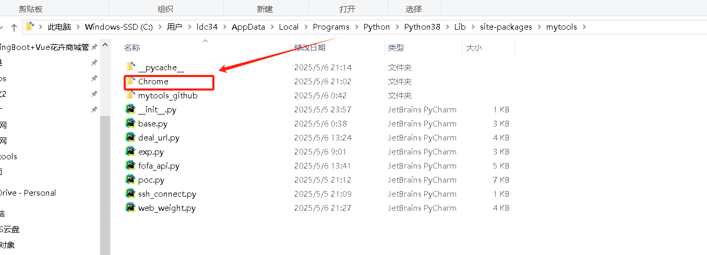

# mytools

一个用于简化python开发流程的工具


### 📜 免责声明（Disclaimer）

本工具仅供授权安全测试、漏洞验证、资产识别、自动化学习与技术研究用途使用。请您在使用本工具前务必仔细阅读以下内容：

1. **合法授权原则**：
    本工具所涉及的 POC、EXP、批量调用接口、网站权重查询等功能，仅限在拥有授权的系统或资产上使用。任何**未授权**的攻击、渗透测试、扫描行为均属违法，使用者需对自己的行为负责。
2. **风险自负原则**：
    运行本工具可能对目标系统产生不可预知的影响，包括但不限于触发 WAF、系统崩溃、数据损坏等。作者不对使用本工具造成的任何直接或间接损失负责。
3. **依赖与环境说明**：
    本工具依赖若干 Python 包（如 `selenium`、`requests`、`urllib3` 等）以及网络环境支持。脚本会检查这些组件的可用性，并在用户许可下尝试自动修复。
4. **接口与资源引用**：
    工具可能会引用第三方平台如 FOFA、爱站网等提供的服务，相关平台的版权归属原网站。请合理使用，避免频繁请求对目标平台造成负担或触发封禁。

------

⚠️ **使用本工具即视为您已阅读并完全理解以上免责声明内容，并同意承担使用过程中的全部法律与技术责任。**

------


## 安装 git 工具 

```bash
1. 安装 git 工具
2. 向 shadowOats 申请python脚本拉取权限
3. pip install git+https://github.com/shadowOats/mytools.git
```


## 谷歌脚本使用前提 

> 如果不想使用该模块, 在__init__.py 文件中, 注释掉 web_weight 引入就好了  

```
1. 将 Chrome 包放到pagesite的mytools文件夹内
2. 将 chromedriver 放到python安装目录内

将github仓库中， Releases 中的两个压缩包下载下来 (Chrome, chromedriver)
```


```
1. 将 chromedriver.zip 解压出来
```

```
2. 在终端使用 py -0p, 查找你pycharm中使用的python的安装路径
3. 将解压出来的 chromedriver 复制到安装路径下
```





```
4. 将 Chrome.zip 解压出来, 通过 from mytools import * 进入 __init__.py 目录
5. 将 Chrome, 放入 __init__.py 同级目录中
```








## 使用说明  (详见手册 新手教程.md)

别急， 还没写 QAQ


## 备忘录

```
git add .
git commit -m "你也不想被调查吧"
git push
```


## 更新仓库

> 可以在pycharm 终端中 依次输入以下代码， 即可绑定本项目地址， 如果 git remote -v 已经绑定了本项目， 往后更新项目的时候， 只需要执行 git pull origin main 即可更新

```
git status
git init
git remote add origin https://github.com/shadowOats/mytools.git
git remote -v
git pull origin main
```

